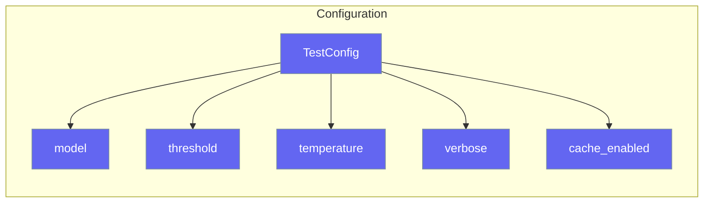

# Configuration

Configure TestAgent behavior with `TestConfig`.



## TestConfig Options

| Option | Type | Default | Description |
|--------|------|---------|-------------|
| `model` | `str` | `"gpt-4o-mini"` | LLM model to use |
| `threshold` | `float` | `7.0` | Pass/fail threshold |
| `temperature` | `float` | `0.0` | LLM temperature |
| `verbose` | `bool` | `False` | Verbose output |
| `cache_enabled` | `bool` | `True` | Enable caching |
| `cache_dir` | `str` | `".testagent_cache"` | Cache directory |

## Usage

### Global Configuration

```python
from testagent import TestConfig, set_config

set_config(TestConfig(
    model="gpt-4",
    threshold=8.0,
    verbose=True,
))
```

### Per-Test Configuration

```python
from testagent import TestAgent, TestConfig

tester = TestAgent(config=TestConfig(
    model="gpt-4",
    threshold=9.0,
))

result = tester.run("output", criteria="is correct")
```

### CLI Configuration

```bash
testagent "output" --model gpt-4 --threshold 8.0 --verbose
```

## Environment Variables

```bash
export OPENAI_API_KEY="your-key"
export AITEST_MODEL="gpt-4"
export AITEST_THRESHOLD="8.0"
```
