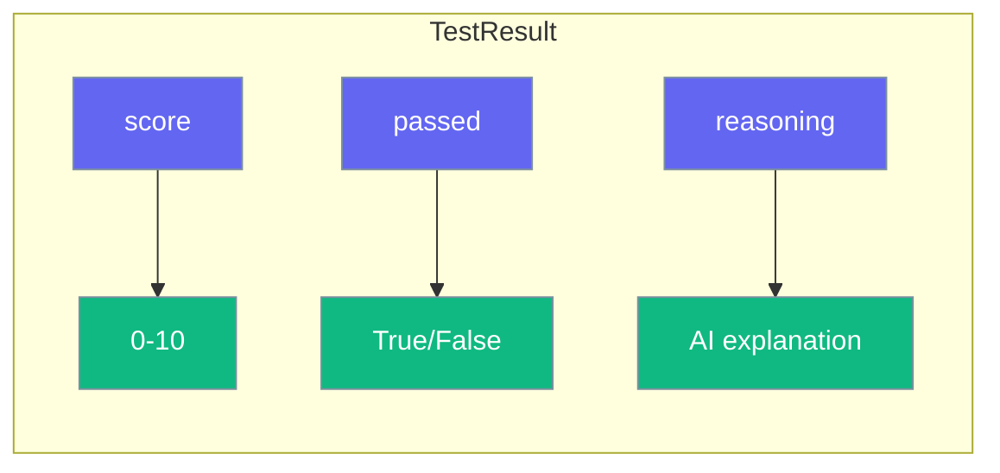

# Test Results

Every test returns a `TestResult` object with score, status, and reasoning.



## TestResult Fields

| Field | Type | Description |
|-------|------|-------------|
| `score` | `float` | Score from 0 to 10 |
| `passed` | `bool` | True if score ≥ threshold |
| `reasoning` | `str` | AI's explanation |
| `criteria` | `str` | Criteria used |
| `expected` | `str` | Expected output |
| `output` | `str` | Tested output |
| `duration` | `float` | Test duration in seconds |

## Usage

```python
from testagent import test

result = test("Hello world", criteria="is a greeting")

# Access fields
print(f"Score: {result.score}")
print(f"Passed: {result.passed}")
print(f"Reasoning: {result.reasoning}")

# Convert to dict
data = result.to_dict()
```

## Threshold

Default threshold is 7.0. Customize it:

```python
from testagent import TestConfig, set_config

set_config(TestConfig(threshold=8.0))
```

## Serialization

```python
# To dictionary
data = result.to_dict()

# To JSON
import json
json_str = json.dumps(result.to_dict())
```
