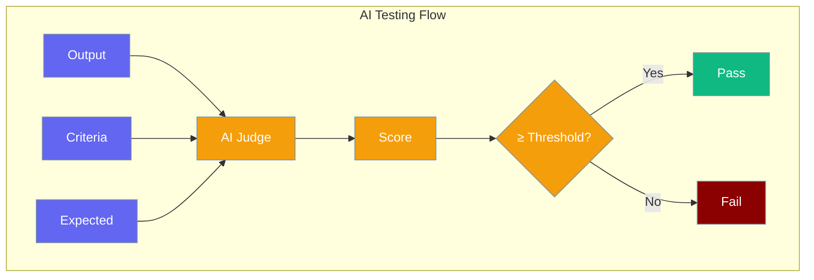

# Testing with AI

TestAgent uses AI to evaluate outputs against criteria or expected values.



## Core Functions

### test()

The main testing function:

```python
from testagent import test

result = test(
    "The capital of France is Paris",
    criteria="factually correct"
)
```

**Parameters:**

| Parameter | Type | Description |
|-----------|------|-------------|
| `output` | `str` | The output to test |
| `expected` | `str` | Optional expected output |
| `criteria` | `str` | Optional evaluation criteria |

### accuracy()

Compare output to expected value:

```python
from testagent import accuracy

result = accuracy("4", expected="4")
```

### criteria()

Evaluate against custom criteria:

```python
from testagent import criteria

result = criteria(
    "Hello! How can I help?",
    criteria="is a friendly greeting"
)
```

## TestAgent Class

For more control, use the class directly:

```python
from testagent import TestAgent, TestConfig

tester = TestAgent(config=TestConfig(
    model="gpt-4",
    threshold=8.0,
))

result = tester.run("output", criteria="is correct")
```

## Async Support

```python
from testagent import TestAgent

tester = TestAgent()
result = await tester.run_async("output", criteria="is correct")
```

## How It Works

1. **Input**: Your output + criteria/expected
2. **Judge**: AI evaluates the output
3. **Score**: Returns 0-10 score
4. **Result**: Pass if score ≥ threshold (default: 7.0)
