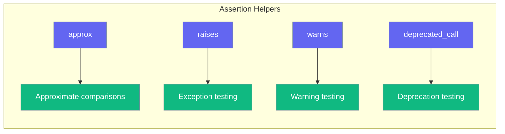

# Assertions

pytest-like assertion helpers for testing.



## approx()

Approximate floating-point comparisons:

```python
from testagent import approx

# Basic comparison
assert 0.1 + 0.2 == approx(0.3)

# AI score comparison
assert result.score == approx(7.5, abs=0.5)

# With relative tolerance
assert 100.0 == approx(99.0, rel=0.02)  # 2% tolerance

# Lists and dicts
assert [0.1, 0.2] == approx([0.1, 0.2])
assert {"a": 0.1} == approx({"a": 0.1})
```

**Parameters:**

| Parameter | Type | Default | Description |
|-----------|------|---------|-------------|
| `expected` | `float/list/dict` | - | Expected value |
| `rel` | `float` | `1e-6` | Relative tolerance |
| `abs` | `float` | `1e-12` | Absolute tolerance |

## raises()

Test that code raises an exception:

```python
from testagent import raises

# Basic usage
with raises(ValueError):
    raise ValueError("test error")

# With message matching
with raises(ValueError, match="invalid"):
    raise ValueError("invalid input")

# Access exception info
with raises(ValueError) as excinfo:
    raise ValueError("test message")
assert "test message" in str(excinfo.value)
```

**Parameters:**

| Parameter | Type | Description |
|-----------|------|-------------|
| `expected_exception` | `type` | Expected exception type |
| `match` | `str/Pattern` | Regex to match message |

## warns()

Test that code issues a warning:

```python
from testagent import warns
import warnings

# Basic usage
with warns(UserWarning):
    warnings.warn("test", UserWarning)

# With message matching
with warns(DeprecationWarning, match="deprecated"):
    warnings.warn("deprecated feature", DeprecationWarning)
```

## deprecated_call()

Test for deprecation warnings:

```python
from testagent import deprecated_call
import warnings

with deprecated_call():
    warnings.warn("deprecated", DeprecationWarning)
```

Captures:

- `DeprecationWarning`
- `PendingDeprecationWarning`
- `FutureWarning`
