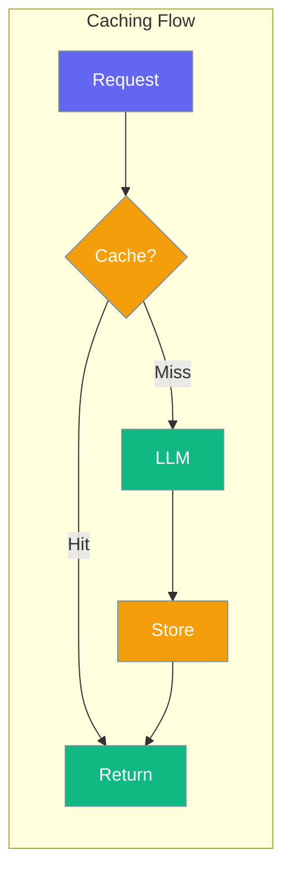

# Caching

Cache LLM responses to reduce costs and improve speed.



## Enable Caching

Caching is enabled by default:

```python
from testagent import TestConfig, set_config

set_config(TestConfig(cache_enabled=True))
```

## Cache Location

Default: `.testagent_cache/`

```python
set_config(TestConfig(cache_dir="my_cache/"))
```

## CLI Commands

### Clear Cache

```bash
testagent cache-clear
```

### View Statistics

```bash
testagent cache-stats
```

Output:
```
Cache Statistics
  Entries: 42
  Size: 15360 bytes
  Location: .testagent_cache
```

## TestAgentCache Class

Direct cache access:

```python
from testagent import TestAgentCache, CacheKey

cache = TestAgentCache()

# Create cache key
key = CacheKey(
    output="test output",
    criteria="is correct",
    model="gpt-4o-mini"
)

# Get/set
result = cache.get(key)
cache.set(key, result)

# Statistics
stats = cache.stats()
print(f"Entries: {stats['entries']}")

# Clear
cache.clear()
```

## CacheKey

| Field | Type | Description |
|-------|------|-------------|
| `output` | `str` | Tested output |
| `criteria` | `str` | Evaluation criteria |
| `expected` | `str` | Expected output |
| `model` | `str` | LLM model used |

## Best Practices

!!! tip "When to Cache"
    - Repeated tests with same inputs
    - CI/CD pipelines
    - Development iterations

!!! warning "When Not to Cache"
    - Testing non-deterministic outputs
    - When you need fresh evaluations
