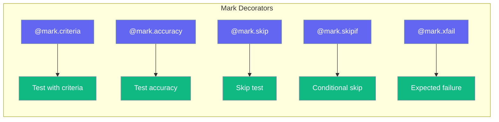

# Decorators

pytest-like decorators for AI tests.



## @mark.criteria

Test output against criteria:

```python
from testagent import mark

@mark.criteria("output is helpful and accurate")
def test_helpfulness():
    return "Hello! I'm here to help you."
```

**Parameters:**

| Parameter | Type | Default | Description |
|-----------|------|---------|-------------|
| `criteria` | `str` | - | Criteria to evaluate |
| `threshold` | `float` | `7.0` | Pass threshold |

## @mark.accuracy

Test output accuracy:

```python
from testagent import mark

@mark.accuracy(expected="4")
def test_math():
    return "4"
```

## @mark.skip

Skip a test:

```python
from testagent import mark

@mark.skip(reason="Not implemented yet")
def test_future_feature():
    pass
```

## @mark.skipif

Conditional skip:

```python
from testagent import mark
import sys

@mark.skipif(sys.platform == 'win32', reason="Unix only")
def test_unix_feature():
    pass
```

## @mark.xfail

Expected failure:

```python
from testagent import mark

@mark.xfail(reason="Known bug #123")
def test_known_bug():
    assert False

@mark.xfail(reason="Should pass", strict=True)
def test_strict():
    # If this passes, test fails
    pass
```

**Parameters:**

| Parameter | Type | Default | Description |
|-----------|------|---------|-------------|
| `reason` | `str` | `""` | Reason for expected failure |
| `strict` | `bool` | `False` | Fail if test passes |
