# Test Discovery

Discover and collect tests without running them.

```mermaid
graph TB
    subgraph "Discovery Flow"
        A[📁 Directory] --> B[🔍 Collector]
        B --> C[📄 test_*.py]
        C --> D[🧪 test_* functions]
        D --> E[📋 TestAgentItem]
    end
    
    classDef input fill:#6366F1,stroke:#7C90A0,color:#fff
    classDef process fill:#F59E0B,stroke:#7C90A0,color:#fff
    classDef output fill:#10B981,stroke:#7C90A0,color:#fff
    
    class A input
    class B,C,D process
    class E output
```



## CLI Usage

```bash
# Discover tests in current directory
testagent collect

# Discover in specific path
testagent collect tests/

# With file pattern
testagent collect . --pattern "test_*.py"
```

Output:
```
Collected 15 tests in 0.023s

tests/test_core.py
  ├── test_basic
  ├── test_criteria
  ├── test_accuracy

tests/test_assertions.py
  ├── test_approx
  ├── test_raises [skip]
```

## Python API

```python
from testagent import Collector, collect
from pathlib import Path

# Simple collection
modules = collect(Path("tests/"))

# With Collector class
collector = Collector()
collector.file_patterns = ["test_*.py"]
modules = collector.collect_only(Path("tests/"))

for module in modules:
    print(f"Module: {module.path}")
    for item in module.items:
        print(f"  - {item.name}")
```

## Collector Options

| Option | Type | Default | Description |
|--------|------|---------|-------------|
| `file_patterns` | `list[str]` | `["test_*.py"]` | File patterns to match |
| `function_patterns` | `list[str]` | `["test_*"]` | Function patterns |

## TestAgentItem

Each discovered test is an `TestAgentItem`:

| Field | Type | Description |
|-------|------|-------------|
| `name` | `str` | Test function name |
| `nodeid` | `str` | Unique test identifier |
| `path` | `Path` | File path |
| `markers` | `list[str]` | Applied markers |

## TestAgentModule

Tests are grouped by module:

| Field | Type | Description |
|-------|------|-------------|
| `path` | `Path` | Module file path |
| `items` | `list[TestAgentItem]` | Tests in module |
