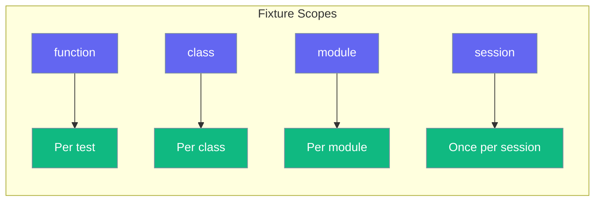

# Fixtures

Reusable test setup with the `@fixture` decorator.



## Basic Fixture

```python
from testagent import fixture

@fixture
def ai_client():
    """Create an AI client for testing."""
    return AIClient()
```

## Fixture with Scope

```python
from testagent import fixture

@fixture(scope="session")
def expensive_resource():
    """Created once per test session."""
    return create_expensive_resource()
```

## Setup and Teardown

Use `yield` for cleanup:

```python
from testagent import fixture

@fixture
def database():
    """Setup and teardown database."""
    db = create_database()
    yield db
    db.cleanup()
```

## Scopes

| Scope | Description |
|-------|-------------|
| `function` | Created for each test (default) |
| `class` | Created once per test class |
| `module` | Created once per module |
| `session` | Created once per test session |

## Example

```python
from testagent import fixture

@fixture
def api_key():
    return "test-api-key"

@fixture(scope="session")
def model():
    return "gpt-4o-mini"

@fixture
def test_client(api_key, model):
    return TestClient(api_key=api_key, model=model)
```

## Fixture Metadata

Fixtures store metadata:

```python
@fixture(scope="module")
def my_fixture():
    return 42

# Access metadata
assert my_fixture._testagent_fixture is True
assert my_fixture._testagent_fixture_scope == "module"
```
