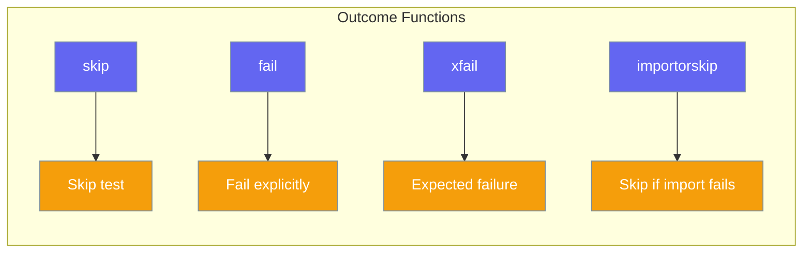

# Outcomes

Control test execution with skip, fail, and xfail.



## skip()

Skip the current test:

```python
from testagent import skip

def test_feature():
    if not feature_available():
        skip("Feature not available")
    # test code
```

## fail()

Explicitly fail a test:

```python
from testagent import fail

def test_something():
    if unexpected_condition():
        fail("Unexpected condition occurred")
```

## xfail()

Mark test as expected to fail:

```python
from testagent import xfail

def test_known_bug():
    xfail("Known bug #123")
    # This test is expected to fail
```

## importorskip()

Skip if module is not available:

```python
from testagent import importorskip

def test_numpy_feature():
    np = importorskip("numpy")
    # Use numpy
    
def test_pandas_version():
    pd = importorskip("pandas", minversion="1.0.0")
    # Use pandas >= 1.0.0
```

**Parameters:**

| Parameter | Type | Description |
|-----------|------|-------------|
| `modname` | `str` | Module name to import |
| `minversion` | `str` | Minimum version required |
| `reason` | `str` | Custom skip reason |

## Exception Classes

| Class | Description |
|-------|-------------|
| `Skipped` | Raised when test is skipped |
| `Failed` | Raised when test fails explicitly |
| `XFailed` | Raised for expected failures |

```python
from testagent import Skipped, Failed, XFailed

try:
    skip("reason")
except Skipped as e:
    print(f"Skipped: {e}")
```
