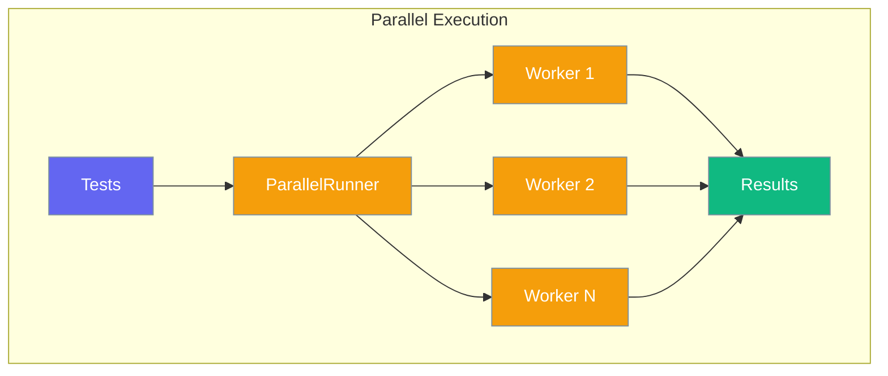

# Parallel Execution

Run tests concurrently for faster execution.



## Quick Start

```python
from testagent import run_parallel

results = run_parallel([
    ("output1", {"criteria": "is correct"}),
    ("output2", {"criteria": "is helpful"}),
    ("output3", {"expected": "4"}),
])

for result in results:
    print(f"{result.passed}: {result.score}")
```

## ParallelRunner Class

```python
from testagent import ParallelRunner

runner = ParallelRunner(max_workers=4)

tests = [
    {"output": "Hello", "criteria": "is a greeting"},
    {"output": "4", "expected": "4"},
]

results = runner.run(tests)
```

## Options

| Option | Type | Default | Description |
|--------|------|---------|-------------|
| `max_workers` | `int` | `4` | Maximum concurrent workers |

## Thread Safety

TestAgent is thread-safe by default:

- Each test runs in isolation
- No shared mutable state
- Results are collected safely

## Best Practices

!!! tip "When to Use Parallel"
    - Many independent tests
    - Tests with similar duration
    - CI/CD pipelines

!!! warning "When Not to Use"
    - Tests with shared resources
    - Rate-limited APIs
    - Sequential dependencies
