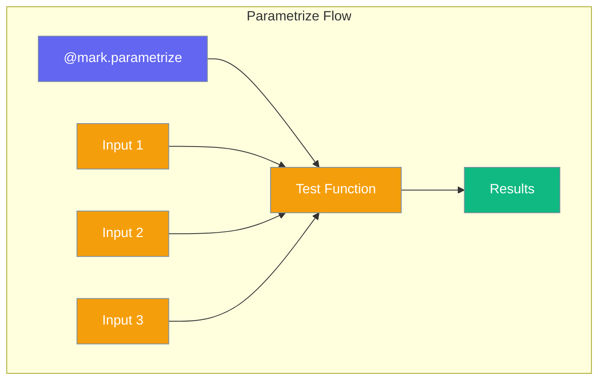

# Parametrize

Data-driven testing with multiple inputs.



## Basic Usage

```python
from testagent import mark

@mark.parametrize("x", [1, 2, 3])
def test_single_arg(x):
    return x * 2
```

## Multiple Arguments

```python
from testagent import mark

@mark.parametrize("x, y", [(1, 2), (3, 4), (5, 6)])
def test_multiple_args(x, y):
    return x + y
```

## With param()

Use `param()` for custom IDs and marks:

```python
from testagent import mark, param

@mark.parametrize("x", [
    param(1, id="one"),
    param(2, id="two"),
    param(3, id="three"),
])
def test_with_ids(x):
    return x

@mark.parametrize("x", [
    param(1, marks=mark.skip(reason="skip this")),
    param(2),
])
def test_with_marks(x):
    return x
```

## AI Testing Example

```python
from testagent import mark

@mark.parametrize("prompt, expected_type", [
    ("Hello", "greeting"),
    ("What is 2+2?", "question"),
    ("Calculate 5*5", "command"),
])
def test_prompt_classification(prompt, expected_type):
    # Your AI classification logic
    return classify(prompt)
```

## param() Parameters

| Parameter | Type | Description |
|-----------|------|-------------|
| `*values` | `Any` | Parameter values |
| `marks` | `tuple` | Marks to apply |
| `id` | `str` | Custom test ID |
