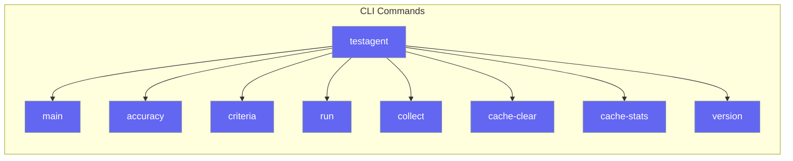

# CLI Usage

TestAgent provides a powerful command-line interface for testing.



## Commands

### Main Command

Test any output with AI:

```bash
testagent "The capital of France is Paris" --criteria "factually correct"
```

**Options:**

| Option | Short | Description |
|--------|-------|-------------|
| `--criteria` | `-c` | Criteria to evaluate against |
| `--expected` | `-e` | Expected output for accuracy |
| `--threshold` | `-t` | Score threshold (default: 7.0) |
| `--model` | `-m` | LLM model to use |
| `--verbose` | `-v` | Verbose output |
| `--json` | | Output as JSON |

### accuracy

Test output accuracy:

```bash
testagent accuracy "4" --expected "4"
```

### criteria

Test against custom criteria:

```bash
testagent criteria "Hello world" --criteria "is a friendly greeting"
```

### run

Run AI tests with pytest-like options:

```bash
# Run all tests
testagent run tests/

# Show slowest tests
testagent run tests/ --durations=5

# Stop on first failure
testagent run tests/ -x

# Verbose output
testagent run tests/ -v
```

**Options:**

| Option | Short | Description |
|--------|-------|-------------|
| `--pattern` | `-p` | File pattern (e.g., 'test_*.py') |
| `--durations` | | Show N slowest tests |
| `--durations-min` | | Minimum duration to show |
| `--exitfirst` | `-x` | Exit on first failure |
| `--verbose` | `-v` | Verbose output |

### collect

Discover tests without running:

```bash
testagent collect tests/
testagent collect . --pattern "test_*.py"
```

### cache-clear

Clear the test cache:

```bash
testagent cache-clear
```

### cache-stats

Show cache statistics:

```bash
testagent cache-stats
```

### version

Show version:

```bash
testagent version
```

## Exit Codes

| Code | Meaning |
|------|---------|
| 0 | All tests passed |
| 1 | Some tests failed |
| 2 | Error occurred |
| 5 | No tests collected |

## Examples

```bash
# Basic test
testagent "Hello" --criteria "is a greeting"

# JSON output for scripting
testagent "4" --expected "4" --json

# Verbose with custom model
testagent "Paris" -c "is a city" -v -m "gpt-4"

# Run tests with duration reporting
testagent run tests/ --durations=10 -v
```
