# Quick Start

Get started with TestAgent in under 5 minutes.

```mermaid
graph LR
    subgraph "Your First Test"
        A[📝 Your Output] --> B[🤖 test]
        B --> C{✅ Passed?}
        C -->|Yes| D[🎉 Success]
        C -->|No| E[🔍 Review]
    end
    
    classDef input fill:#6366F1,stroke:#7C90A0,color:#fff
    classDef process fill:#F59E0B,stroke:#7C90A0,color:#fff
    classDef success fill:#10B981,stroke:#7C90A0,color:#fff
    classDef review fill:#8B0000,stroke:#7C90A0,color:#fff
    
    class A input
    class B process
    class C,D success
    class E review
```



## Step 1: Install TestAgent

```bash
pip install testagent
```

## Step 2: Set Your API Key

```bash
export OPENAI_API_KEY="your-api-key"
```

## Step 3: Write Your First Test

```python
from testagent import test

# Test any output with custom criteria
result = test(
    "The capital of France is Paris",
    criteria="factually correct"
)

print(f"Score: {result.score}/10")
print(f"Passed: {result.passed}")
print(f"Reasoning: {result.reasoning}")
```

## Step 4: Run It

```bash
python my_test.py
```

Output:
```
Score: 9.5/10
Passed: True
Reasoning: The statement is factually correct. Paris is indeed the capital of France.
```

## Three Ways to Test

### 1. Criteria Testing

Test output against custom criteria:

```python
from testagent import criteria

result = criteria(
    "Hello! How can I help you today?",
    criteria="is a friendly greeting"
)
assert result.passed
```

### 2. Accuracy Testing

Compare output to expected value:

```python
from testagent import accuracy

result = accuracy("4", expected="4")
assert result.passed
```

### 3. General Testing

Combine both approaches:

```python
from testagent import test

# With criteria
result = test("Paris", criteria="is a city name")

# With expected output
result = test("4", expected="4")

# With both
result = test("Paris", expected="Paris", criteria="matches exactly")
```

## Using Decorators

pytest-like decorators for test functions:

```python
from testagent import mark

@mark.criteria("output is helpful and accurate")
def test_helpfulness():
    return "Hello! I'm here to help you with any questions."

@mark.accuracy(expected="4")
def test_math():
    return "4"
```

## CLI Usage

Test from the command line:

```bash
# Criteria test
testagent "Hello world" --criteria "is a greeting"

# Accuracy test
testagent accuracy "4" --expected "4"

# With verbose output
testagent "Paris" --criteria "is a city" --verbose
```

## Next Steps

- [CLI Usage](cli.md) - Full CLI reference
- [Assertions](../features/assertions.md) - approx, raises, warns
- [Decorators](../features/decorators.md) - @mark.skip, @mark.xfail
