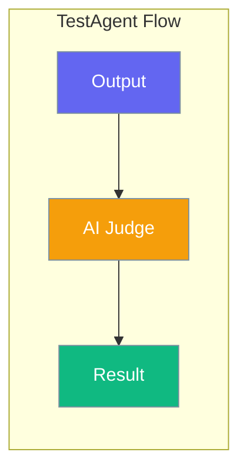

# TestAgent

**The world's easiest way to test anything using AI.**



## Quick Start

=== "Python"

    ```python
    from testagent import test
    
    result = test("The capital of France is Paris", criteria="factually correct")
    assert result.passed
    ```

=== "TypeScript"

    ```typescript
    import { test } from 'aitestagent';
    
    const result = await test("The capital of France is Paris", {
      criteria: "factually correct"
    });
    console.log(result.passed);
    ```

=== "CLI"

    ```bash
    testagent "The capital of France is Paris" --criteria "factually correct"
    ```

## Features

| Feature | Description |
|---------|-------------|
| **Simple API** | One function to test anything |
| **pytest-like** | Familiar decorators and assertions |
| **CLI Support** | Test from command line |
| **Caching** | Cache LLM responses for speed |
| **Parallel** | Run tests concurrently |
| **Fixtures** | Reusable test setup |

## Installation

```bash
pip install testagent
```

## Why TestAgent?

- **Beginner-friendly**: Just one function to learn
- **pytest-compatible**: Use familiar patterns
- **Fast**: Lazy imports, caching, parallel execution
- **Flexible**: Test any AI output with custom criteria

## Next Steps

- [Installation Guide](getting-started/installation.md)
- [Quick Start Tutorial](getting-started/quickstart.md)
- [CLI Usage](getting-started/cli.md)
